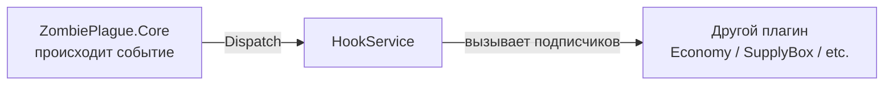
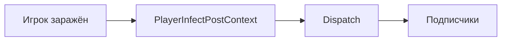
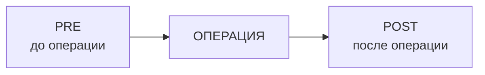
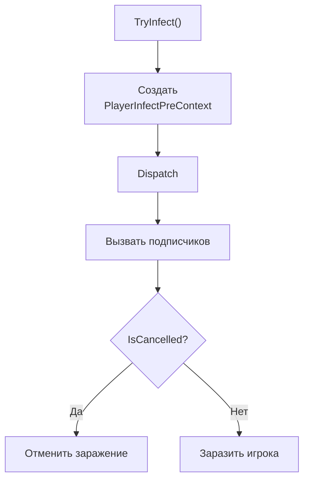
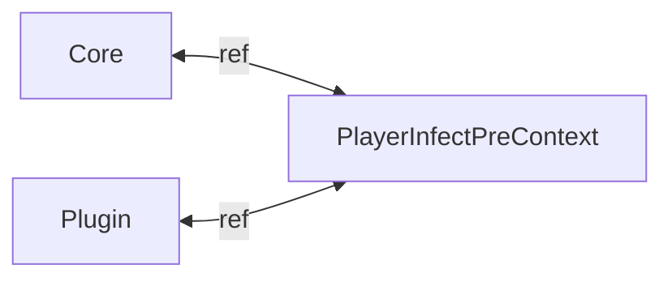
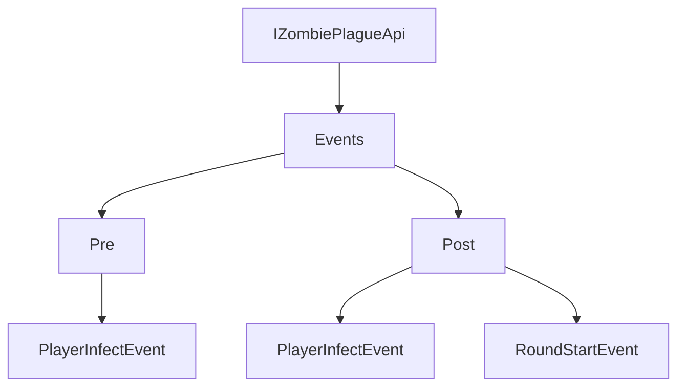
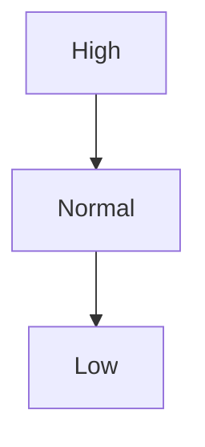
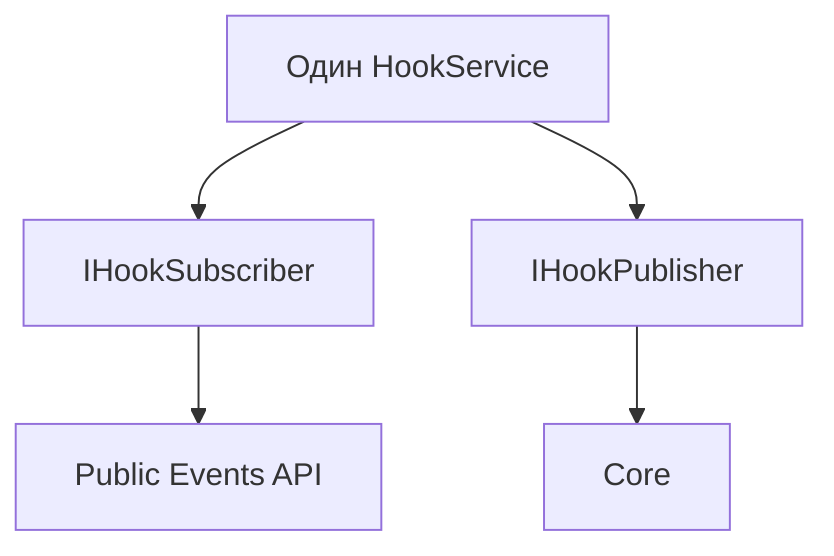
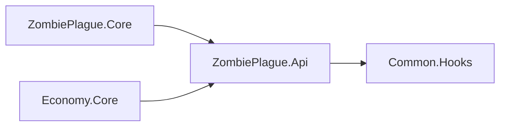
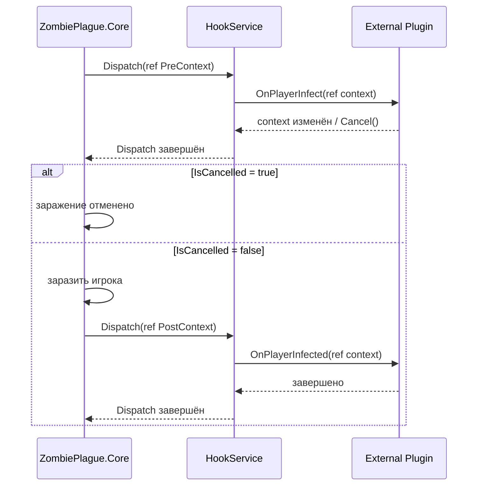

# Common.Hooks

`Common.Hooks` — небольшой механизм событий между модулями проекта.

Он позволяет одному модулю сообщить другим:

> «Сейчас что-то произойдёт»

или:

> «Что-то уже произошло»

Например `ZombiePlague.Core` может сообщить другим плагинам:

```text
Игрок собирается заразиться
          ↓
     Pre-событие
          ↓
      Заражение
          ↓
     Post-событие
```

Другие модули могут подписаться на эти события:

```csharp
zombiePlague.Events.Pre.PlayerInfectEvent += OnPlayerInfect;
```

или:

```csharp
zombiePlague.Events.Post.PlayerInfectEvent += OnPlayerInfected;
```

---

# 1. Как это работает

У системы есть три основных участника:



Например происходит заражение игрока.

`ZombiePlague.Core` создаёт контекст:

```csharp
var context = new PlayerInfectPreContext(
    player,
    infector
);
```

Затем отправляет его:

```csharp
hooks.Dispatch(ref context);
```

`HookService` находит всех подписчиков:

```text
PlayerInfectPreContext
        │
        ├── Plugin A
        ├── Plugin B
        └── Plugin C
```

и вызывает их по очереди.

После этого управление возвращается обратно в `ZombiePlague.Core`.

---

# 2. Самый простой пример

Представим событие:

```text
Игрок заражается
```

Мы хотим дать другим плагинам возможность узнать об этом.

## Шаг 1 — создаём контекст

```csharp
public struct PlayerInfectPostContext(
    IPlayer player,
    IPlayer? infector
) : IPostHookContext
{
    public IPlayer Player { get; set; } = player;

    public IPlayer? Infector { get; set; } = infector;
}
```

Контекст содержит данные события:

```text
PlayerInfectPostContext
│
├── Player
└── Infector
```

---

## Шаг 2 — Core отправляет событие

После заражения:

```csharp
var context = new PlayerInfectPostContext(
    player,
    infector
);

hooks.Dispatch(ref context);
```

Получается:



---

## Шаг 3 — другой плагин подписывается

Например `Economy.Core` хочет выдать деньги заражающему.

```csharp
zombiePlague.Events.Post.PlayerInfectEvent += OnPlayerInfected;
```

Обработчик:

```csharp
private void OnPlayerInfected(
    ref PlayerInfectPostContext context)
{
    if (context.Infector is null)
    {
        return;
    }

    GiveMoney(context.Infector);
}
```

Теперь при каждом заражении:

```text
ZombiePlague.Core
        │
        │ заражение произошло
        ▼
PlayerInfectPostContext
        │
        ▼
    HookService
        │
        ▼
   Economy.Core
        │
        ▼
   GiveMoney()
```

---

# 3. Pre и Post

Hooks делятся на два основных типа:



Например заражение:

```text
PlayerInfectPreContext
          ↓
     заражение
          ↓
PlayerInfectPostContext
```

---

# 4. Pre Hook

`Pre` вызывается **до выполнения действия**.

Он используется, когда подписчикам нужно:

- проверить действие;
- изменить параметры;
- отменить действие.

Контекст реализует:

```csharp
IPreHookContext
```

Например:

```csharp
public struct PlayerInfectPreContext(
    IPlayer player,
    IPlayer? infector
) : IPreHookContext
{
    public IPlayer Player { get; set; } = player;

    public IPlayer? Infector { get; set; } = infector;

    public bool IsCancelled { get; private set; }

    public void Cancel()
    {
        IsCancelled = true;
    }
}
```

Core:

```csharp
var context = new PlayerInfectPreContext(
    player,
    infector
);

hooks.Dispatch(ref context);

if (context.IsCancelled)
{
    return false;
}
```

Полный путь:



---

# 5. Как отменить действие

Подписчик может сделать:

```csharp
private void OnPlayerInfect(
    ref PlayerInfectPreContext context)
{
    if (HasImmunity(context.Player))
    {
        context.Cancel();
    }
}
```

После этого:

```csharp
context.IsCancelled == true
```

Core увидит это:

```csharp
hooks.Dispatch(ref context);

if (context.IsCancelled)
{
    return false;
}
```

Важно:

```text
Cancel()
```

не останавливает остальные hooks.

Например:

```text
Plugin A
   │
   │ Cancel()
   ▼
IsCancelled = true
   │
   ▼
Plugin B
   │
   ▼
Plugin C
```

Все подписчики всё равно получат событие.

`Cancel()` означает только:

> После Dispatch producer не должен выполнять операцию.

---

# 6. Post Hook

`Post` вызывается после того, как действие уже произошло.

Например:

```csharp
var zombie = zombieController.Create(player);

AddOrReplaceRole(zombie);

var context = new PlayerInfectPostContext(
    player,
    infector
);

hooks.Dispatch(ref context);
```

Схема:

```text
Игрок человек
      │
      ▼
  заражение
      │
      ▼
Игрок зомби
      │
      ▼
Post Hook
      │
      ├── Economy выдаёт деньги
      ├── Rating записывает заражение
      └── другой plugin реагирует
```

У `Post` нет:

```csharp
Cancel()
```

Потому что операция уже произошла.

---

# 7. Почему используется `ref`

Все контексты являются `struct`.

Например:

```csharp
public struct PlayerInfectPreContext
```

Если передать `struct` обычным способом, будет создана копия.

```text
Core Context
     │
     │ copy
     ▼
Plugin Context
```

Тогда изменения plugin не попадут обратно в Core.

Поэтому используется:

```csharp
ref
```

```csharp
private void OnPlayerInfect(
    ref PlayerInfectPreContext context)
{
    context.Infector = anotherPlayer;
}
```

Теперь обе стороны работают с одним контекстом:



Plugin может изменить:

```csharp
context.Player
context.Infector
```

а Core увидит новые значения после `Dispatch`.

---

# 8. Как создать новое событие

Допустим мы хотим добавить:

```text
RoundStartEvent
```

Сначала создаём контекст.

Например Post-событие:

```csharp
public struct RoundStartPostContext(
    IRound round
) : IPostHookContext
{
    public IRound Round { get; set; } = round;
}
```

Теперь Core может вызвать:

```csharp
var context = new RoundStartPostContext(this);

hooks.Dispatch(ref context);
```

На этом уровне `Common.Hooks` уже умеет работать с новым событием.

Никаких изменений в самом `HookService` не требуется.

---

# 9. Как вывести событие в публичный API

Обычно внешний plugin не должен работать напрямую с:

```csharp
hooks.Hook(...)
```

Вместо этого мы создаём красивый C# event.

Например:

```csharp
public interface IZombiePlaguePostEvents
{
    event HookHandler<RoundStartPostContext> RoundStartEvent;
}
```

Реализация:

```csharp
internal sealed class ZombiePlaguePostEvents(
    IHookSubscriber hooks
) : IZombiePlaguePostEvents
{
    public event HookHandler<RoundStartPostContext> RoundStartEvent
    {
        add => hooks.Hook(value);
        remove => hooks.Unhook(value);
    }
}
```

Теперь пользователь API пишет:

```csharp
zombiePlague.Events.Post.RoundStartEvent += OnRoundStarted;
```

а не:

```csharp
hooks.Hook<RoundStartPostContext>(...);
```

---

# 10. Полная схема публичного API

Для ZombiePlague получается:



Использование выглядит просто:

```csharp
zombiePlague.Events.Pre.PlayerInfectEvent += OnPlayerInfect;
```

```csharp
zombiePlague.Events.Post.PlayerInfectEvent += OnPlayerInfected;
```

```csharp
zombiePlague.Events.Post.RoundStartEvent += OnRoundStarted;
```

---

# 11. Подписка и отписка

Подписываемся:

```csharp
protected override void OnReady()
{
    zombiePlague.Events.Post.PlayerInfectEvent +=
        OnPlayerInfected;
}
```

Обязательно отписываемся:

```csharp
protected override void OnUnload()
{
    zombiePlague.Events.Post.PlayerInfectEvent -=
        OnPlayerInfected;
}
```

Полный пример:

```csharp
protected override void OnReady()
{
    zombiePlague.Events.Post.PlayerInfectEvent +=
        OnPlayerInfected;
}

protected override void OnUnload()
{
    zombiePlague.Events.Post.PlayerInfectEvent -=
        OnPlayerInfected;
}

private void OnPlayerInfected(
    ref PlayerInfectPostContext context)
{
    Console.WriteLine(
        $"Player infected: {context.Player.SteamID}"
    );
}
```

---

# 12. Что происходит внутри HookService

Все подписки хранятся по типу контекста.

Упрощённо:

```text
HookService
│
├── PlayerInfectPreContext
│   ├── PluginA.OnPlayerInfect
│   └── PluginB.OnPlayerInfect
│
├── PlayerInfectPostContext
│   ├── Economy.OnPlayerInfected
│   └── Rating.OnPlayerInfected
│
└── RoundStartPostContext
    └── SupplyBox.OnRoundStarted
```

Когда Core делает:

```csharp
hooks.Dispatch(ref context);
```

`HookService` смотрит:

```csharp
typeof(TContext)
```

и вызывает только подписчиков этого контекста.

---

# 13. Порядок выполнения

Hooks могут иметь priority:

```csharp
hooks.Hook<PlayerInfectPreContext>(
    OnPlayerInfect,
    HookPriority.High
);
```

Есть:

```text
High
Normal
Low
```

Порядок:



Если priority одинаковый, обработчики выполняются в порядке регистрации:

```text
1. Plugin A
2. Plugin B
3. Plugin C
```

Обычный публичный API через:

```csharp
+=
```

использует:

```csharp
HookPriority.Normal
```

---

# 14. Что будет, если plugin упадёт

Каждый subscriber вызывается независимо.

Например:

```text
Economy
   │
   X Exception
   │
   ▼
Exception Handler
   │
   ▼
RoundRatingNotify
```

Ошибка `Economy` не должна мешать вызову `RoundRatingNotify`.

Упрощённо `Dispatch` работает так:

```csharp
foreach (var handler in handlers)
{
    try
    {
        handler(ref context);
    }
    catch (Exception exception)
    {
        exceptionHandler?.Invoke(...);
    }
}
```

Это особенно важно, потому что hooks позволяют внешним плагинам выполнять код внутри lifecycle другого модуля.

---

# 15. Почему создаётся snapshot

Перед вызовом подписчиков создаётся копия текущего списка:

```text
Исходные подписчики:

A
B
C

        ↓ snapshot

[A, B, C]
```

Допустим `A` делает:

```text
Unhook(B)
```

Текущий snapshot всё ещё:

```text
[A, B, C]
```

поэтому `B` может быть вызван ещё один раз.

Следующее событие уже получит:

```text
[A, C]
```

Это позволяет безопасно подписываться и отписываться внутри callback.

---

# 16. Где должен жить HookService

`HookService` принадлежит producer-модулю.

Например:

```text
ZombiePlague.Core
      │
      └── HookService

Economy.Core
      │
      └── свой HookService

CustomKnife.Core
      │
      └── свой HookService
```

Это НЕ одна глобальная шина событий для всего сервера.

Если `Economy` слушает ZombiePlague:

```csharp
zombiePlague.Events.Post.PlayerInfectEvent += ...
```

подписка попадает именно в:

```text
ZombiePlague HookService
```

---

# 17. DI

Producer создаёт один `HookService`.

```csharp
AddSingleton<HookService>(service);
```

И этот же объект используется как subscriber:

```csharp
AddSingleton<IHookSubscriber>(
    service,
    provider => provider.GetRequiredService<HookService>()
);
```

и publisher:

```csharp
AddSingleton<IHookPublisher>(
    service,
    provider => provider.GetRequiredService<HookService>()
);
```

Схема:



Важно:

`IHookSubscriber` и `IHookPublisher` должны ссылаться на **один экземпляр**.

---

# 18. Где хранить контексты

`Common.Hooks` содержит только общий механизм:

```text
Common.Hooks
│
├── IHookContext
├── IPreHookContext
├── IPostHookContext
├── IHookSubscriber
├── IHookPublisher
├── HookHandler
├── HookPriority
└── HookService
```

Конкретные события туда добавлять нельзя.

Например:

```text
PlayerInfectPreContext
```

относится к ZombiePlague.

Поэтому он находится:

```text
ZombiePlague.Api
└── Events
    └── Contexts
        └── PlayerInfectPreContext.cs
```

Так зависимости остаются правильными:



`Common.Hooks` ничего не знает про ZombiePlague.

---

# 19. Полный пример

Producer:

```csharp
public bool TryInfect(
    IPlayer player,
    IPlayer? infector = null)
{
    var preContext = new PlayerInfectPreContext(
        player,
        infector
    );

    hooks.Dispatch(ref preContext);

    if (preContext.IsCancelled)
    {
        return false;
    }

    InfectPlayer(
        preContext.Player
    );

    var postContext = new PlayerInfectPostContext(
        preContext.Player,
        preContext.Infector
    );

    hooks.Dispatch(ref postContext);

    return true;
}
```

Consumer:

```csharp
protected override void OnReady()
{
    zombiePlague.Events.Pre.PlayerInfectEvent +=
        OnPlayerInfect;

    zombiePlague.Events.Post.PlayerInfectEvent +=
        OnPlayerInfected;
}
```

```csharp
private void OnPlayerInfect(
    ref PlayerInfectPreContext context)
{
    if (HasImmunity(context.Player))
    {
        context.Cancel();
    }
}
```

```csharp
private void OnPlayerInfected(
    ref PlayerInfectPostContext context)
{
    GiveReward(context.Infector);
}
```

```csharp
protected override void OnUnload()
{
    zombiePlague.Events.Pre.PlayerInfectEvent -=
        OnPlayerInfect;

    zombiePlague.Events.Post.PlayerInfectEvent -=
        OnPlayerInfected;
}
```

И вся цепочка выглядит так:



---

# Коротко

Если нужно добавить новое событие:

```text
1. Создать Context
          ↓
2. Выбрать Pre или Post
          ↓
3. В Core вызвать Dispatch
          ↓
4. Добавить event в публичный API
          ↓
5. Подписываться через +=
          ↓
6. Отписываться через -=
```

Пример:

```text
RoundStartPostContext
        ↓
hooks.Dispatch(ref context)
        ↓
Events.Post.RoundStartEvent
        ↓
SupplyBox.Core
```

На этом всё.

В большинстве случаев разработчику, который использует `Common.Hooks`,
не нужно знать внутреннее устройство `HookService`.

Достаточно помнить:

```text
Pre  = до действия
Post = после действия
ref  = можно менять context
Cancel = отменить действие
+=   = подписаться
-=   = отписаться
```