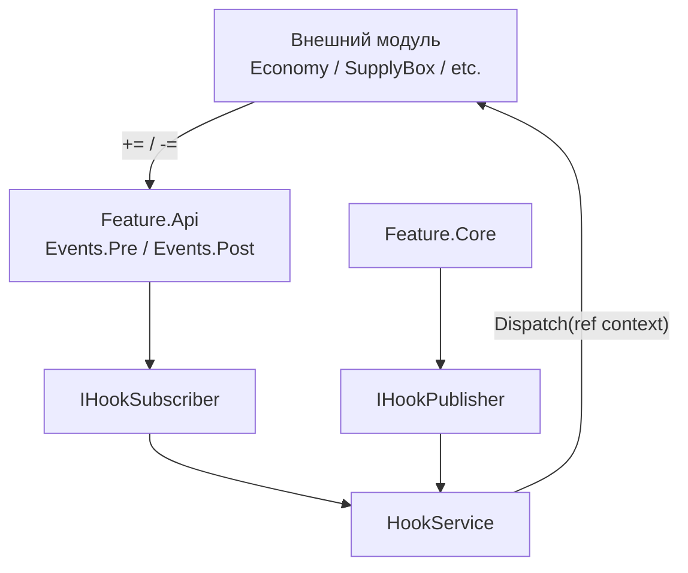
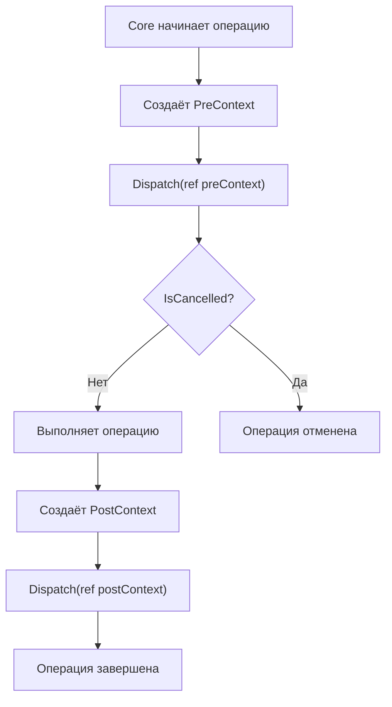
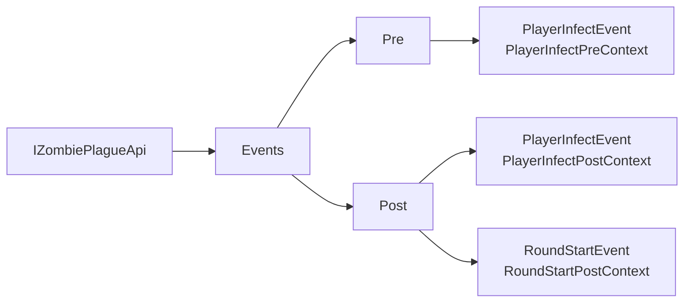
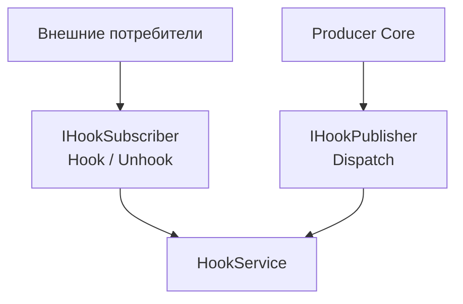
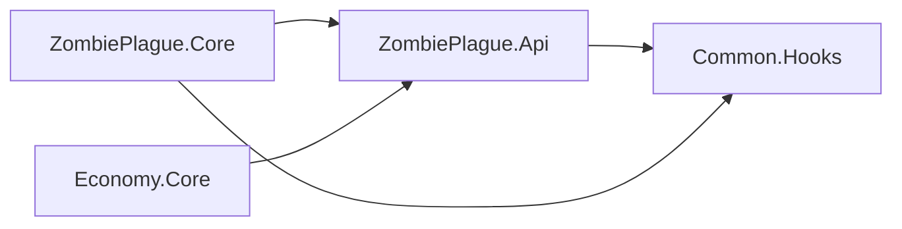
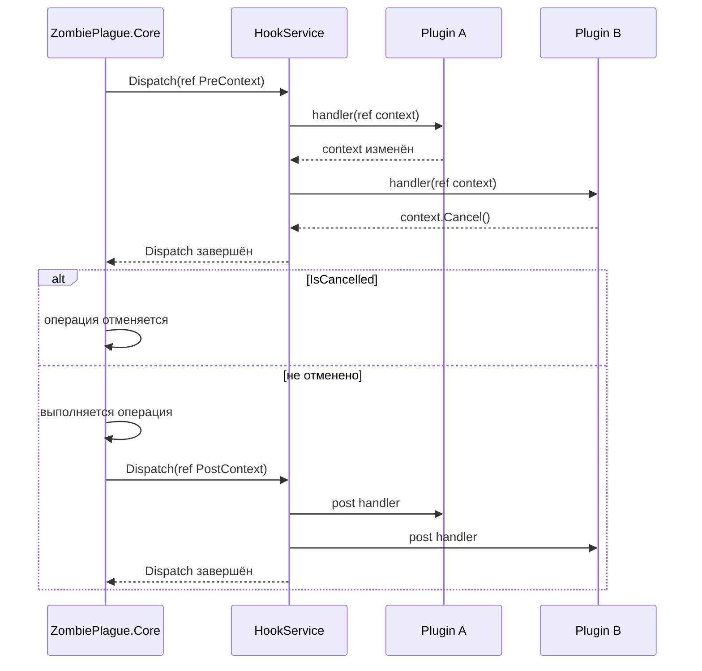

# Common.Hooks

`Common.Hooks` — небольшой универсальный механизм синхронных хуков для взаимодействия между модулями проекта.

Он позволяет модулю-производителю события:

- публиковать `Pre` и `Post` события;
- передавать изменяемый контекст через `ref`;
- позволять подписчикам отменять операцию на стадии `Pre`;
- управлять порядком выполнения обработчиков через приоритеты;
- изолировать ошибки отдельных подписчиков;
- скрывать внутренний `HookService` за обычным C# API с `+=` / `-=`.

`Common.Hooks` не содержит зависимостей от SwiftlyS2, ZombiePlague или других игровых модулей.

---

## Основная идея

Есть две стороны:

1. **Publisher** — модуль, в котором событие происходит.
2. **Subscriber** — модуль, который хочет отреагировать на событие.

Например:

```text
ZombiePlague.Core
      |
      | игрок заражается
      v
PlayerInfectPreContext
      |
      v
   HookService
      |
      +------> Economy.Core
      |
      +------> Другой плагин
      |
      v
ZombiePlague.Core продолжает заражение
```

Общая архитектура:



---

# Основные компоненты

## `IHookContext`

Базовый marker-интерфейс для любого hook-контекста.

```csharp
public interface IHookContext;
```

Сам по себе он не задаёт никакого поведения.

Он нужен для ограничения generic API:

```csharp
where TContext : struct, IHookContext
```

---

## `IPreHookContext`

Контекст события, которое происходит **до выполнения операции**.

```csharp
public interface IPreHookContext : IHookContext
{
    bool IsCancelled { get; }

    void Cancel();
}
```

`Pre`-событие позволяет:

- изменить параметры операции;
- отменить операцию;
- проверить, отменил ли её предыдущий обработчик.

Пример:

```csharp
public struct PlayerInfectPreContext(
    IPlayer player,
    IPlayer? infector = null
) : IPreHookContext
{
    public IPlayer Player { get; set; } = player;

    public IPlayer? Infector { get; set; } = infector;

    public bool IsCancelled { get; private set; }

    public void Cancel()
    {
        IsCancelled = true;
    }
}
```

---

## `IPostHookContext`

Контекст события, которое происходит **после успешного выполнения операции**.

```csharp
public interface IPostHookContext : IHookContext;
```

У `Post`-контекста намеренно нет `Cancel()`.

После выполнения операции отменять уже нечего.

Пример:

```csharp
public struct PlayerInfectPostContext(
    IPlayer player,
    IPlayer? infector = null
) : IPostHookContext
{
    public IPlayer Player { get; set; } = player;

    public IPlayer? Infector { get; set; } = infector;
}
```

---

# Жизненный цикл события

Типичная операция состоит из трёх этапов:



На примере заражения игрока:

```csharp
var preContext = new PlayerInfectPreContext(
    player,
    infector
);

hooks.Dispatch(ref preContext);

if (preContext.IsCancelled)
{
    return false;
}

var zombie = zombieController.Create(
    preContext.Player
);

// заражение игрока

var postContext = new PlayerInfectPostContext(
    preContext.Player,
    preContext.Infector
);

hooks.Dispatch(ref postContext);
```

---

# Почему контекст передаётся через `ref`

Обработчик объявляется так:

```csharp
public delegate void HookHandler<TContext>(
    ref TContext context
)
    where TContext : struct, IHookContext;
```

Контекст является `struct`.

Без `ref` обработчик получил бы копию структуры:

```text
Core context
     |
     | копирование
     v
Plugin context

изменения не вернутся обратно
```

При использовании `ref`:

```text
            один context
                 |
        +--------+--------+
        |                 |
        v                 v
      Core             Plugin
                          |
                          | context.Infector = ...
                          v
                  Core видит изменение
```

Например внешний плагин может изменить заражающего:

```csharp
private void OnPlayerInfect(
    ref PlayerInfectPreContext context)
{
    context.Infector = anotherPlayer;
}
```

После возвращения из `Dispatch` producer увидит новое значение:

```csharp
preContext.Infector
```

---

# Отмена операции

`Cancel()` используется только в `Pre`-контекстах.

Например:

```csharp
private void OnPlayerInfect(
    ref PlayerInfectPreContext context)
{
    if (HasImmunity(context.Player))
    {
        context.Cancel();
    }
}
```

После завершения всех обработчиков producer проверяет:

```csharp
hooks.Dispatch(ref context);

if (context.IsCancelled)
{
    return false;
}
```

Важно:

> `Cancel()` отменяет операцию, но не прекращает распространение hook-события.

То есть:

```text
Handler A
    |
    | Cancel()
    v
IsCancelled = true
    |
    v
Handler B
    |
    v
Handler C
```

Оставшиеся обработчики всё равно вызываются.

Они могут увидеть:

```csharp
context.IsCancelled == true
```

Это намеренное поведение.

Если когда-нибудь понадобится остановка распространения самого события, для этого следует добавить отдельный механизм вроде:

```csharp
StopPropagation()
```

`Cancel()` не должен выполнять две разные задачи.

---

# Подписка

Низкоуровневая подписка выполняется через:

```csharp
IHookSubscriber
```

Например:

```csharp
hooks.Hook<PlayerInfectPreContext>(
    OnPlayerInfect
);
```

Обработчик:

```csharp
private void OnPlayerInfect(
    ref PlayerInfectPreContext context)
{
}
```

Отписка:

```csharp
hooks.Unhook<PlayerInfectPreContext>(
    OnPlayerInfect
);
```

---

# Публичный API модуля

Внешним плагинам обычно не следует напрямую показывать:

```csharp
Hook<TContext>()
Unhook<TContext>()
```

Вместо этого feature API оборачивает их в обычные C# events.

Например:

```csharp
public interface IZombiePlaguePreEvents
{
    event HookHandler<PlayerInfectPreContext> PlayerInfectEvent;
}
```

Реализация:

```csharp
internal sealed class ZombiePlaguePreEvents(
    IHookSubscriber hooks
) : IZombiePlaguePreEvents
{
    public event HookHandler<PlayerInfectPreContext> PlayerInfectEvent
    {
        add => hooks.Hook(value);
        remove => hooks.Unhook(value);
    }
}
```

Теперь внешний модуль получает естественный API:

```csharp
zombiePlague.Events.Pre.PlayerInfectEvent +=
    OnPlayerInfect;
```

и:

```csharp
zombiePlague.Events.Pre.PlayerInfectEvent -=
    OnPlayerInfect;
```

Полная структура:



Использование:

```csharp
zombiePlague.Events.Pre.PlayerInfectEvent +=
    OnPlayerInfect;

zombiePlague.Events.Post.PlayerInfectEvent +=
    OnPlayerInfected;
```

---

# Publisher

Публиковать события может `IHookPublisher`.

```csharp
public interface IHookPublisher
{
    void Dispatch<TContext>(
        ref TContext context
    ) where TContext : struct, IHookContext;
}
```

Например:

```csharp
var context = new RoundStartPostContext(this);

hooks.Dispatch(ref context);
```

`Dispatch` является синхронным.

Это значит, что:

```csharp
hooks.Dispatch(ref context);

// здесь уже выполнились все подписчики
```

---

# Почему Subscriber и Publisher разделены

`HookService` реализует сразу два интерфейса:

```csharp
public sealed class HookService :
    IHookSubscriber,
    IHookPublisher
```

Но назначение у них разное.



Внешнему модулю обычно нужно только право подписки.

Он не должен иметь возможность сделать:

```csharp
Dispatch(...)
```

за другой модуль.

Например `Economy.Core` может слушать:

```csharp
ZombiePlague.Events.Post.PlayerInfectEvent
```

но не должен иметь возможность самостоятельно опубликовать:

```text
PlayerInfectPostContext
```

от имени ZombiePlague.

---

# Регистрация через DI

Для одного producer-модуля должен существовать один экземпляр `HookService`.

Например:

```csharp
AddSingleton<HookService>(service);

AddSingleton<IHookSubscriber>(
    service,
    provider => provider.GetRequiredService<HookService>()
);

AddSingleton<IHookPublisher>(
    service,
    provider => provider.GetRequiredService<HookService>()
);
```

Важно, что:

```text
IHookSubscriber ──────┐
                     |
                     v
                 HookService
                     ^
                     |
IHookPublisher ──────┘
```

Это один и тот же объект.

Нельзя создавать отдельно:

```text
HookService #1 -> подписки

HookService #2 -> Dispatch
```

Иначе publisher никогда не увидит зарегистрированные callbacks.

---

# HookService принадлежит producer-модулю

`Common.Hooks` не является глобальной event-шиной всего сервера.

Каждый producer создаёт собственный экземпляр:

```text
ZombiePlague
    |
    +-- HookService #1

Economy
    |
    +-- HookService #2

CustomKnife
    |
    +-- HookService #3
```

Подписка:

```csharp
zombiePlague.Events.Post.PlayerInfectEvent += handler;
```

регистрируется именно внутри `HookService`, принадлежащего `ZombiePlague`.

Это предотвращает смешивание независимых API.

---

# Приоритеты

При регистрации можно указать приоритет:

```csharp
hooks.Hook<PlayerInfectPreContext>(
    OnPlayerInfect,
    HookPriority.High
);
```

Доступные значения:

```csharp
HookPriority.Low
HookPriority.Normal
HookPriority.High
```

Обработчики с большим приоритетом выполняются раньше.

```text
High
 |
 v
Normal
 |
 v
Low
```

Например:

```text
Handler B : High
Handler A : Normal
Handler C : Low
```

порядок:

```text
1. Handler B
2. Handler A
3. Handler C
```

---

# Одинаковый приоритет

Если несколько обработчиков имеют одинаковый priority, используется порядок регистрации.

Например:

```csharp
hooks.Hook(OnFirst);
hooks.Hook(OnSecond);
hooks.Hook(OnThird);
```

Все используют:

```csharp
HookPriority.Normal
```

Поэтому порядок будет:

```text
1. OnFirst
2. OnSecond
3. OnThird
```

Для этого `HookService` хранит внутренний:

```csharp
_registrationOrder
```

---

# Повторная подписка

Один callback может быть зарегистрирован несколько раз:

```csharp
hooks.Hook<PlayerInfectPreContext>(
    OnPlayerInfect
);

hooks.Hook<PlayerInfectPreContext>(
    OnPlayerInfect
);
```

Тогда он будет вызван два раза:

```text
Dispatch
   |
   +--> OnPlayerInfect
   |
   +--> OnPlayerInfect
```

Это соответствует поведению обычных C# events.

Один `Unhook` удаляет одну регистрацию:

```csharp
hooks.Unhook<PlayerInfectPreContext>(
    OnPlayerInfect
);
```

После этого одна подписка останется.

---

# Экземпляры классов и delegates

Для instance-методов delegate содержит:

```text
Target + Method
```

Например:

```csharp
listenerA.OnPlayerInfect
listenerB.OnPlayerInfect
```

Несмотря на одинаковое название метода, это разные delegates:

```text
Target = listenerA
Method = OnPlayerInfect
```

и:

```text
Target = listenerB
Method = OnPlayerInfect
```

Поэтому отписка одного объекта не удаляет подписку другого.

---

# Snapshot dispatch

Перед выполнением обработчиков `HookService` создаёт snapshot:

```csharp
registrations = [.. registeredHooks];
```

Это означает, что коллекция подписчиков не меняется непосредственно во время текущего обхода.

Сценарий:

```text
Handler A
    |
    | Unhook Handler B
    v

текущий snapshot:
[A, B, C]
```

`Handler B` всё ещё может быть вызван в текущем `Dispatch`.

Но в следующем:

```text
[A, C]
```

его уже не будет.

Это делает поведение предсказуемым и позволяет безопасно делать `Hook` / `Unhook` внутри callback.

---

# Исключения в обработчиках

Ошибка одного subscriber не должна ломать producer или остальные плагины.

Например:

```text
PlayerInfectPostContext
        |
        v
    Economy
        |
        X Exception
        |
        v
 exception handler
        |
        v
RoundRatingNotify
```

Для этого каждый callback выполняется отдельно:

```csharp
try
{
    handler(ref context);
}
catch (Exception exception)
{
    _exceptionHandler?.Invoke(
        exception,
        contextType,
        registration.Handler
    );
}
```

Можно передать внешний обработчик ошибок:

```csharp
var hooks = new HookService(
    (exception, contextType, handler) =>
    {
        // логирование средствами host-модуля
    }
);
```

`Common.Hooks` сам не зависит от конкретного logger.

Это позволяет использовать:

```text
Swiftly logger
Microsoft ILogger
Console
собственную систему логирования
```

без добавления этих зависимостей в `Common.Hooks`.

---

# Пример полного Pre/Post события

Контексты:

```csharp
public struct PlayerInfectPreContext(
    IPlayer player,
    IPlayer? infector
) : IPreHookContext
{
    public IPlayer Player { get; set; } = player;

    public IPlayer? Infector { get; set; } = infector;

    public bool IsCancelled { get; private set; }

    public void Cancel()
    {
        IsCancelled = true;
    }
}
```

```csharp
public struct PlayerInfectPostContext(
    IPlayer player,
    IPlayer? infector
) : IPostHookContext
{
    public IPlayer Player { get; set; } = player;

    public IPlayer? Infector { get; set; } = infector;
}
```

Producer:

```csharp
public bool TryInfect(
    IPlayer player,
    IPlayer? infector = null)
{
    var preContext = new PlayerInfectPreContext(
        player,
        infector
    );

    hooks.Dispatch(ref preContext);

    if (preContext.IsCancelled)
    {
        return false;
    }

    // Выполнение заражения.

    var postContext = new PlayerInfectPostContext(
        preContext.Player,
        preContext.Infector
    );

    hooks.Dispatch(ref postContext);

    return true;
}
```

Consumer:

```csharp
protected override void OnReady()
{
    zombiePlague.Events.Pre.PlayerInfectEvent +=
        OnPlayerInfect;

    zombiePlague.Events.Post.PlayerInfectEvent +=
        OnPlayerInfected;
}
```

```csharp
private void OnPlayerInfect(
    ref PlayerInfectPreContext context)
{
    if (HasImmunity(context.Player))
    {
        context.Cancel();
    }
}
```

```csharp
private void OnPlayerInfected(
    ref PlayerInfectPostContext context)
{
    // Игрок уже заражён.
}
```

Отписка:

```csharp
protected override void OnUnload()
{
    zombiePlague.Events.Pre.PlayerInfectEvent -=
        OnPlayerInfect;

    zombiePlague.Events.Post.PlayerInfectEvent -=
        OnPlayerInfected;
}
```

---

# Где должны находиться контексты

`Common.Hooks` содержит только инфраструктуру.

Он не должен знать о конкретных игровых событиях:

```text
Common.Hooks
├── IHookContext
├── IPreHookContext
├── IPostHookContext
├── IHookSubscriber
├── IHookPublisher
├── HookHandler
├── HookPriority
└── HookService
```

Feature-specific контексты располагаются в публичном API соответствующего модуля:

```text
ZombiePlague.Api
└── Events
    ├── Contexts
    │   ├── PlayerInfectPreContext
    │   ├── PlayerInfectPostContext
    │   └── RoundStartPostContext
    │
    ├── IZombiePlaguePreEvents
    ├── IZombiePlaguePostEvents
    └── IZombiePlagueEvents
```

Таким образом зависимости направлены правильно:



`Common.Hooks` ничего не знает о `ZombiePlague`.

---

# Основные правила

1. Контекст всегда должен быть `struct`.
2. Контекст всегда передаётся через `ref`.
3. `Pre` используется для изменения параметров и отмены операции.
4. `Post` вызывается только после успешного завершения операции.
5. `Cancel()` не прекращает распространение события.
6. Producer обязан самостоятельно проверить `IsCancelled`.
7. `Dispatch` является синхронным.
8. Ошибка одного subscriber не должна ломать остальных.
9. Внешний API желательно предоставлять через обычные C# events.
10. Внешнему consumer не следует предоставлять `IHookPublisher`.
11. Один producer использует один экземпляр `HookService`.
12. Feature-specific контексты не должны находиться в `Common.Hooks`.

---

# Краткая схема



---

# Итог

`Common.Hooks` является инфраструктурным слоем.

Он отвечает только за:

```text
регистрацию
    +
отписку
    +
порядок выполнения
    +
Dispatch
    +
изоляцию ошибок
```

А смысл конкретного события определяется feature-модулем:

```text
Common.Hooks
      |
      +-- механизм

ZombiePlague.Api
      |
      +-- PlayerInfectEvent
      +-- RoundStartEvent

Economy.Api
      |
      +-- MoneyChangedEvent

CustomKnife.Api
      |
      +-- KnifeSelectedEvent
```

Это позволяет использовать один и тот же механизм hooks во всех модулях проекта без связывания их бизнес-логики между собой.