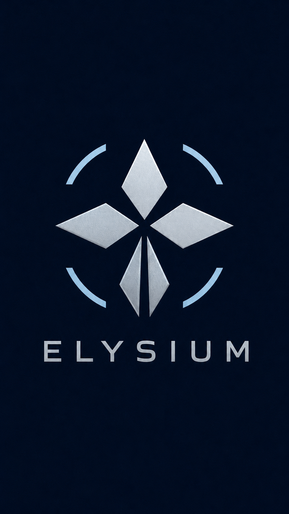
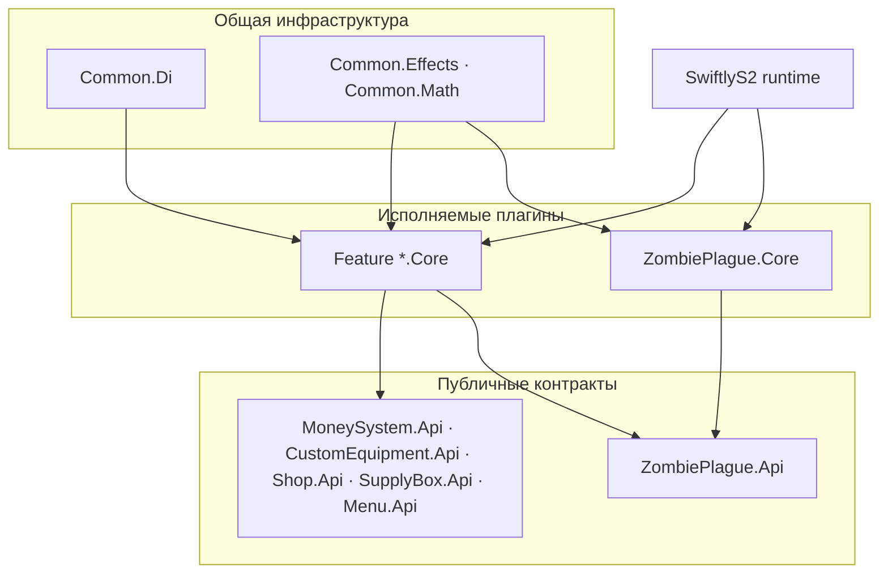
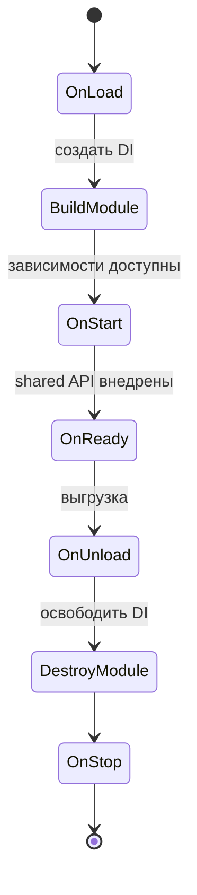

<div align="center">
  

  <h1>Zombie Plague</h1>

  <p>
    Модульная экосистема Zombie Plague для Counter-Strike 2,<br>
    построенная на SwiftlyS2 и .NET 10.
  </p>

  <p>
    <a href="https://github.com/elysium-corp/cs2-zombie-plague">
      
    </a>
    
    
    
    <a href="LICENSE">
      
    </a>
  </p>
</div>

---

## О проекте

**Zombie Plague** — серверная модификация для Counter-Strike 2. Она превращает классический матч в асимметричное противостояние людей и зомби с отдельными режимами раунда, классами, способностями, экономикой, экипировкой и игровыми событиями.

Проект развивается как набор независимых SwiftlyS2-плагинов. Публичные контракты вынесены в `*.Api`, реализация и интеграция с игровым сервером находятся в `*.Core`, а общая инфраструктура переиспользуется через `Common.*`.

### Возможности

| Подсистема | Возможности |
|---|---|
| Zombie Plague | заражение, люди и зомби, классы, способности, knockback и специальные раунды |
| Custom Equipment | пользовательское оружие, гранаты, эффекты, частицы и параметры предметов |
| Custom Knife | ножи с отдельными характеристиками, уроном, knockback и меню выбора |
| Supply Box | сбрасываемые припасы, награды, ограничения по режимам и редактор точек |
| Money System | награды за урон и заражение, собственные правила экономики |
| Shop | категории оружия и экипировки, настраиваемые цены и безопасная покупка через Custom Equipment |
| Menu | расширяемое меню с API, событиями и приоритетами пунктов |
| Notifications | урон, игровые сообщения, затемнение экрана и итоги раунда |
| Utilities | сброс статистики игрока и общие математические/визуальные инструменты |

## Технологии

- **C# / .NET 10**
- **SwiftlyS2.CS2 `1.4.0-beta.37`**
- **Microsoft.Extensions.DependencyInjection**
- **Microsoft.Extensions.Configuration**
- **Microsoft.Extensions.Options**
- **Microsoft.Extensions.Logging**
- JSON-конфигурации, gamedata, templates и локализация

## Архитектура

Решение состоит из **21 проекта** и разделено на четыре слоя:



### Правило `Api` / `Core`

- `*.Api` содержит интерфейсы, события и DTO. Контракт не зависит от реализации.
- `*.Core` содержит SwiftlyS2-плагин, DI-модуль, сервисы, конфигурацию и игровые обработчики.
- Один `Core` может публиковать свой `Api` через `IInterfaceManager`.
- Другие плагины используют только shared-интерфейс, не обращаясь к внутренним сервисам поставщика.
- `Common.*` содержит инфраструктуру без бизнес-контрактов конкретной фичи.

### Модули

| Категория | Проект | Ответственность |
|---|---|---|
| Core | `ZombiePlague.Core` | Основной игровой цикл, заражение, раунды, классы, способности и ресурсы |
| API | `ZombiePlague.Api` | Публичный контракт Zombie Plague и игровые события |
| Core | `MoneySystem.Core` | Экономика и награды |
| API | `MoneySystem.Api` | Контракт денежной системы |
| Core | `SupplyBox.Core` | Жизненный цикл и механика ящиков с припасами |
| API | `SupplyBox.Api` | Контракт и события Supply Box |
| Core | `Menu.Core` | Создание и отображение расширяемых меню |
| API | `Menu.Api` | Контракты меню, publisher/subscriber и события |
| Core | `CustomEquipment.Core` | Пользовательское оружие, гранаты, эффекты и частицы |
| API | `CustomEquipment.Api` | Каталог предметов и контракт безопасной выдачи экипировки |
| Core | `Shop.Core` | Категории магазина, цены, меню и обработка покупок |
| API | `Shop.Api` | Каталог магазина и публичный контракт покупки |
| Core | `CustomKnife.Core` | Система ножей и их игровых свойств |
| Core | `DamageNotify.Core` | Уведомления об уроне |
| Core | `InfoNotify.Core` | Информационные сообщения игрокам |
| Core | `RoundRatingNotify.Core` | Лучшие игроки-люди и зомби по итогам раунда |
| Core | `ScreenFade.Core` | Экранные fade-эффекты |
| Core | `ResetScore.Core` | Сброс статистики командами `reset` и `rs` |
| Common | `Common.Di` | DI-контейнер, модульный lifecycle и разрешение зависимостей |
| Common | `Common.Effects` | Переиспользуемые игровые эффекты |
| Common | `Common.Math` | Общие математические утилиты |

### Зависимости между проектами

| Потребитель | Прямые project-зависимости |
|---|---|
| `ZombiePlague.Core` | `ZombiePlague.Api`, `Menu.Api`, `SupplyBox.Core`, `Common.Effects` |
| `MoneySystem.Core` | `MoneySystem.Api`, `ZombiePlague.Api`, `Common.Di` |
| `SupplyBox.Core` | `SupplyBox.Api`, `ZombiePlague.Api`, `Common.Di` |
| `Menu.Core` | `Menu.Api`, `Common.Di` |
| `DamageNotify.Core` | `ZombiePlague.Api`, `Common.Di` |
| `RoundRatingNotify.Core` | `ZombiePlague.Api`, `Common.Di` |
| `CustomKnife.Core` | `ZombiePlague.Api`, `Common.Di` |
| `CustomEquipment.Core` | `CustomEquipment.Api`, `Common.Di`, `Common.Effects`, `Common.Math` |
| `Shop.Core` | `Shop.Api`, `CustomEquipment.Api`, `MoneySystem.Api`, `Menu.Api`, `ZombiePlague.Api`, `Common.Di` |
| `ScreenFade.Core` | `Common.Di` |
| `ResetScore.Core` | `Common.Di` |
| `InfoNotify.Core` | `Common.Di` |
| `Common.Effects` | `Common.Di` |

## Dependency Injection

Большинство плагинов наследуется от `Plugin<TModule>`, а их DI-модули — от `BaseModule`.

Каждый модуль:

1. создаёт собственный `ServiceCollection`;
2. регистрирует `ISwiftlyCore`;
3. подключает и валидирует JSON-конфигурации;
4. регистрирует singleton/transient-сервисы;
5. создаёт изолированный `ServiceProvider`;
6. освобождает контейнер при выгрузке плагина.

`Common.Di.DependencyManager` хранит контейнер отдельно для каждого `TModule`, поэтому зависимости одной фичи не смешиваются с зависимостями другой. Сервисы разрешаются через `GetRequiredService<T>()` и `GetRequiredServiceLazy<T>()`.

> `ZombiePlague.Core` пока является исключением: он наследуется напрямую от `BasePlugin` и использует собственный статический `ZombiePlague.Core.Di.DependencyManager`. Остальные feature-плагины работают через общий `Plugin<TModule>`.

## Жизненный цикл плагина

`Common.Di` преобразует lifecycle SwiftlyS2 в предсказуемую последовательность:



| Стадия | Что разрешено делать |
|---|---|
| `OnLoad` | Ранняя настройка без обращения к DI |
| `OnStart` | Инициализация сервисов и логики после создания контейнера |
| `ConfigureSharedInterface` | Публикация собственного `*.Api` |
| `UseSharedInterface` | Получение API других плагинов |
| `OnReady` | Подписка на внешние события после внедрения shared-интерфейсов |
| `OnUnload` | Отписка от hooks/events, пока зависимости ещё доступны |
| `OnStop` | Финальная очистка после уничтожения DI-контейнера |

## Структура feature-модуля

```text
Feature.Api/
├── Data/                  # DTO и публичные модели
├── Events/                # Контракты событий
└── IFeatureApi.cs         # Shared API

Feature.Core/
├── src/
│   ├── Api/               # Реализация публичного API
│   ├── Data/              # Внутренние модели
│   ├── Di/                # FeatureModule и регистрации
│   ├── Services/          # Бизнес-логика
│   └── Feature.cs         # SwiftlyS2 entry point
└── resources/
    ├── gamedata/
    ├── templates/
    └── translations/
```

## Сборка

### Требования

- .NET SDK 10
- Counter-Strike 2 Dedicated Server
- совместимая версия SwiftlyS2

### Локальная сборка

```bash
git clone https://github.com/elysium-corp/cs2-zombie-plague.git
cd cs2-zombie-plague
git checkout develop

dotnet restore
dotnet build CS2ZombiePlague.sln -c Release
```

### Публикация модуля

```bash
dotnet publish ZombiePlague.Core/ZombiePlague.Core.csproj -c Release
dotnet publish Menu.Core/Menu.Core.csproj -c Release
dotnet publish MoneySystem.Core/MoneySystem.Core.csproj -c Release
dotnet publish Shop.Core/Shop.Core.csproj -c Release
```

Для `*.Core` сборка складывается в `output/<ProjectName>/`. После `publish` MSBuild также формирует ZIP-архив модуля. Каталоги `resources/gamedata`, `resources/templates` и `resources/translations` копируются автоматически.

> `*.Api` — библиотеки контрактов. Их не следует устанавливать как самостоятельные игровые плагины.

## Конфигурация и ресурсы

- **gamedata** — offsets, signatures и patches;
- **templates** — шаблоны игровых сущностей и визуальных элементов;
- **translations** — локализация, включая `en` и `ru`;
- **JSON config** — настройки модулей с валидацией через Options API;
- **exports** — экспортируемые ресурсы основного плагина.

Конфигурации регистрируются в DI через `AddConfig<TConfig>()` и могут автоматически перечитываться при изменении файла.

## Добавление нового модуля

1. Создайте `Feature.Api` для публичных контрактов.
2. Создайте `Feature.Core` и добавьте ссылку на `Feature.Api`.
3. Реализуйте `FeatureModule : BaseModule`.
4. Унаследуйте entry point от `Plugin<FeatureModule>`.
5. Публикуйте API в `ConfigureSharedInterface`.
6. Получайте внешние API в `UseSharedInterface`.
7. Регистрируйте игровые hooks в `OnReady`.
8. Обязательно снимайте hooks и подписки в `OnUnload`.
9. Добавьте оба проекта в `CS2ZombiePlague.sln`.

## Ветки

- `master` — стабильная версия;
- `develop` — основная ветка разработки;
- `feature/*` — изолированная разработка возможностей.

## Лицензия

Проект распространяется по лицензии [GNU General Public License v3.0](LICENSE).

---

<div align="center">
  <strong>ELYSIUM</strong><br>
  <sub>Built for the outbreak.</sub>
</div>
